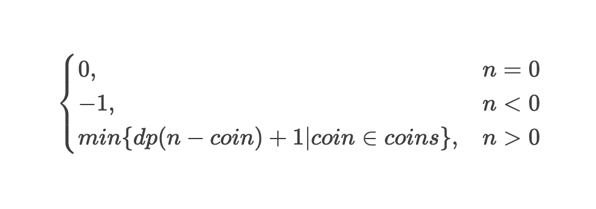

# 动态规划【算零钱问题】

> 题目：给你 k 种面值的硬币，面值分别为 c1, c2 ... ck，每种硬币的数量无限，再给一个总金额 amount，问你最少需要几枚硬币凑出这个金额，如果不可能凑出，算法返回 -1 。

## 状态转移方程



## JS 实现

```javascript
function coinChange(coins, amount) {
  function dp(n) {
    if (n === 0) return 0;
    if (n < 0) return -1;
    let res = Number.POSITIVE_INFINITY;

    for (const coin of coins) {
      const subProblem = dp(n - coin);
      if (subProblem === -1) continue;
      res = Math.min(res, subProblem + 1);
    }

    return res !== Number.POSITIVE_INFINITY ? res : -1;
  }

  return dp(amount);
}

coinChange([1, 2, 5], 11); // 3
```

带备忘录的实现

```javascript
function coinChange(coins, amount) {
  const memo = new Map();

  function dp(n) {
    if (memo.has(n)) return memo.get(n);

    if (n === 0) return 0;
    if (n < 0) return -1;
    let res = Number.POSITIVE_INFINITY;

    for (const coin of coins) {
      const subProblem = dp(n - coin);
      if (subProblem === -1) continue;
      res = Math.min(res, subProblem + 1);
    }

    memo.set(n, res !== Number.POSITIVE_INFINITY ? res : -1);
    return memo.get(n);
  }

  return dp(amount);
}

coinChange([1, 2, 5], 11); // 3
```
